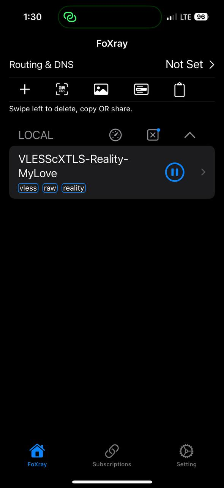
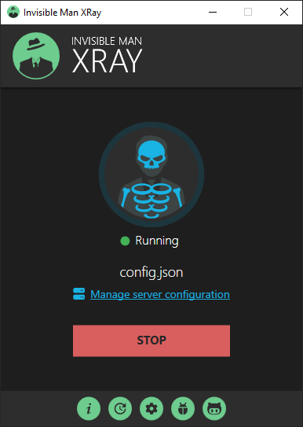

## Для IOS и macOS

Инструкция по использованию UndefinedVPN для IOS ( IOS 16+)
 - Установить приложение FoXray на Iphone или macOS ( IOS 16+ )
 - Копируем ключ VPN
 - Заходим в приложение FoXray 
 - 
 - Нажимаен на иконку с планшетом/кнопку вставить и все
 - Должен появиться VPN конфиг, запускаем и все✨

## Для Windows

Инструкция по использованию UndefinedVPN на Windows
 - Скачиваем приложение для Windows по ссылке - https://github.com/InvisibleManVPN/InvisibleMan-XRayClient/releases
 - Расспаковываем и запускаем от имени администратора
 - 
 - Наживаем на "Manage server configuration"
 - Жмем на плюс и выбираем вставить ключ 
 - Вставляем ключ, запускаем и пользуемся✨

## Для Android

Инструкция по использованию UndefinedVPN на Android
 - Скачиваем и устанавливаем приложение для Android по ссылке - https://github.com/MatsuriDayo/NekoBoxForAndroid/releases
 - Жмем на плюс и выбираем вставить ключ 
 - Вставляем ключ, запускаем и пользуемся✨

НУ И ВСЕ

